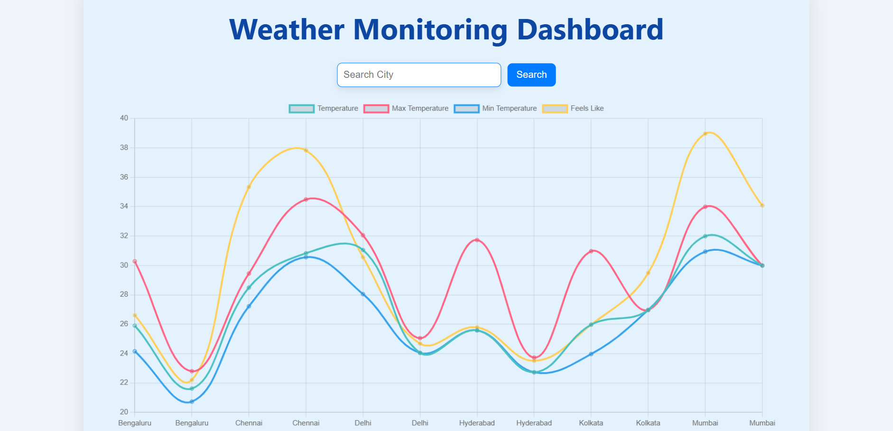
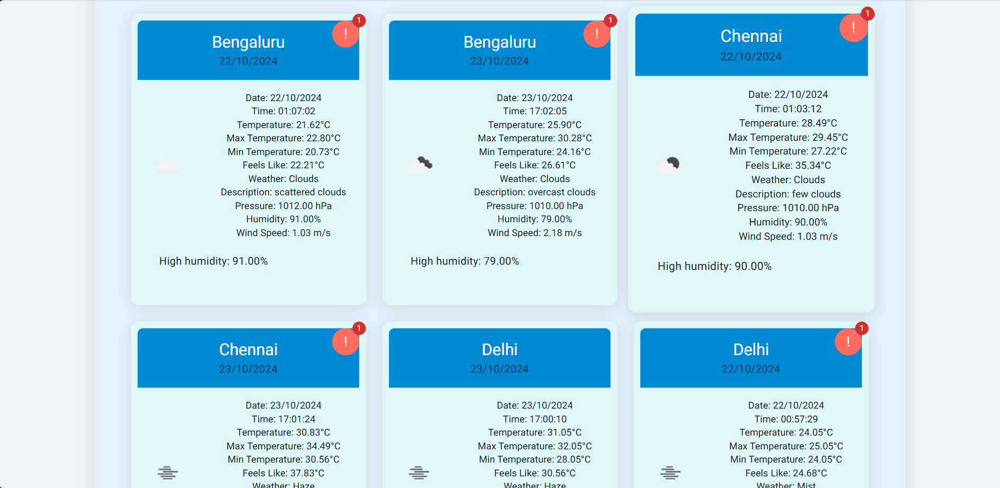

# Weather Monitoring System

## Overview
The Weather Tracker Application is a dynamic web solution that retrieves and displays up-to-date weather information for selected cities. Leveraging the OpenWeatherMap API, the application seamlessly integrates data storage with MongoDB, providing users with an engaging interface built with React. The system notifies users about significant weather changes through alerts, ensuring they stay informed about local conditions.

## Core Features
- Provides real-time weather updates for various cities.
- Uses MongoDB to store and manage weather data efficiently.
- Displays weather forecasts and historical data trends.
- Sends alerts for extreme weather conditions such as heavy rainfall or high winds.
- Interactive visualizations to showcase temperature and humidity variations.

## Tech Stack
- **Server:** Node.js, Express, MongoDB, Mongoose
- **Client:** React, Material-UI, Chart.js
- **Data Source:** OpenWeatherMap API

## Setup Instructions

### Prerequisites
- Ensure you have Node.js and npm installed.
- Set up a MongoDB database (either via MongoDB Atlas or locally).

### Steps to Follow
1. Clone the repository:
   ```bash
   git clone https://github.com/harshitSingh1/Real-Time-Data-Processing-System.git
   cd Real-Time-Data-Processing-System

2. Install backend dependencies:
   cd backend
   npm install
   node index.js

3. Install frontend dependencies:
    cd frontend
    npm install
    npm start


      
## API Reference
 - GET /
   - Returns a simple message indicating that the server is running.

 - GET /api/weather
   - Fetches the summarized weather data for the tracked cities.

- GET /api/alerts
  - Placeholder for future alerts endpoint.

## Alerts
 - Alerts are generated when the following thresholds are exceeded:

 - Temperature: > 35°C
 - Humidity: > 60%
 - Wind Speed: > 7 m/s

## Backend Functionality: 
 - The server automatically fetches new weather data from the OpenWeatherMap API at regular intervals and updates the MongoDB database with this data.

## Frontend Functionality: 
 - The React app refreshes weather data every 15 seconds from the backend API, providing users with live updates in an intuitive interface.

## Output

